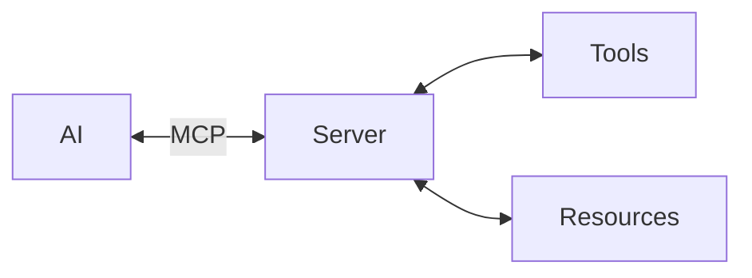
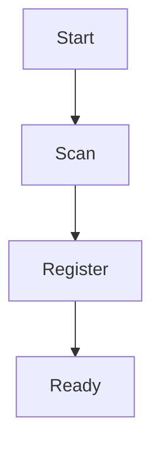
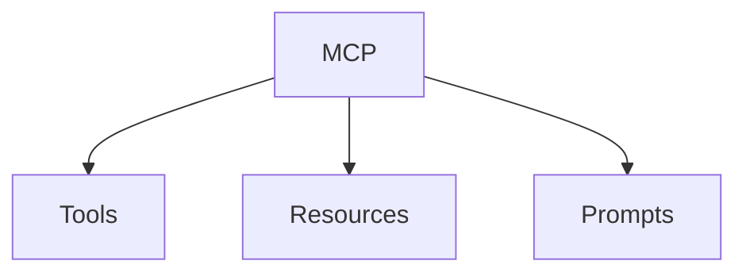
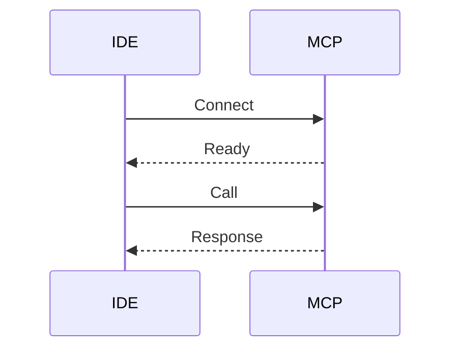

# MCP Server Starter (TypeScript)

<div align="center">

[](https://modelcontextprotocol.io)
[](https://www.typescriptlang.org/)
[](https://nodejs.org/)
[](LICENSE)

A minimal, production-ready TypeScript starter template for building [Model Context Protocol (MCP)](https://modelcontextprotocol.io) servers.

</div>

## 🎯 Motivation

The Model Context Protocol (MCP) is an open protocol that standardizes how AI applications connect to data sources and tools. Think of it as "USB-C for AI" - a universal standard that allows any AI model to connect with any data source or tool through a consistent interface.



This starter template provides:
- ✅ **Minimal boilerplate** to get you started quickly
- ✅ **Auto-loading architecture** for tools, resources, and prompts
- ✅ **TypeScript best practices** with strict typing
- ✅ **Production-ready structure** that scales with your project
- ✅ **Working example** (echo tool) to demonstrate the pattern

Whether you're building integrations for databases, APIs, file systems, or custom business tools, this template helps you create MCP servers that can be used by any MCP-compatible client (like Claude Desktop, IDEs, or custom applications).

## 📋 Table of Contents

- [Features](#-features)
- [Prerequisites](#-prerequisites)
- [Installation](#-installation)
- [Quick Start](#-quick-start)
- [Transport Modes](#-transport-modes)
  - [Stdio Mode](#stdio-mode-default)
  - [HTTP Mode](#http-mode-sse--json-rpc)
  - [Environment Variables](#environment-variables)
  - [Configuration Examples](#configuration-examples)
- [Docker Support](#-docker-support)
- [Project Structure](#-project-structure)
- [Development Guide](#-development-guide)
  - [Using Code Generators](#using-code-generators)
  - [Adding a New Tool](#adding-a-new-tool)
  - [Adding a Resource](#adding-a-resource)
  - [Adding a Prompt](#adding-a-prompt)
- [Testing with MCP Inspector](#-testing-with-mcp-inspector)
- [Configuration](#-configuration)
- [Commands](#-commands)
- [Integration](#-integration)
- [Contributing](#-contributing)
- [License](#-license)

## ✨ Features

- 🚀 **Auto-loading Module System** - Drop new tools, resources, or prompts into their directories and they're automatically registered
- 🛠️ **TypeScript First** - Full type safety with strict TypeScript configuration
- 📦 **Minimal Dependencies** - Only essential packages included
- 🧪 **Built-in Testing** - Uses Node.js native test runner
- 🔍 **MCP Inspector Support** - Test your server with the official MCP Inspector
- 📝 **Extensible Architecture** - Clear patterns for adding new capabilities
- 🎯 **Example Implementation** - Working echo tool demonstrates the pattern
- ⚡ **Code Generators** - Hygen scaffolding for rapid module creation
- 🌐 **Dual Transport Support** - Both stdio and HTTP (SSE + JSON-RPC) transports
- 🐳 **Docker Ready** - Containerized deployment with multi-stage builds

## 📚 Prerequisites

> [!IMPORTANT]
> Ensure you have Node.js version 20.11.0 or higher installed before proceeding.

- Node.js >= 20.11.0
- npm or yarn
- Basic understanding of TypeScript
- Familiarity with the [Model Context Protocol](https://modelcontextprotocol.io) concepts

## 📦 Installation

### Clone and Setup

```bash
# Clone the repository
git clone https://github.com/alexanderop/mcp-server-starter-ts.git
cd mcp-server-starter-ts

# Install dependencies
npm install

# Build the project
npm run build
```

### Using as a Template

You can also use this as a GitHub template:

1. Click "Use this template" on GitHub
2. Create your new repository
3. Clone and start building your MCP server

## 🚀 Quick Start

> [!TIP]
> Use the MCP Inspector to test your server interactively during development!

1. **Build the server:**
   ```bash
   npm run build
   ```

2. **Test with MCP Inspector:**
   ```bash
   npm run inspect
   ```
   This opens the MCP Inspector where you can interact with your server's tools, resources, and prompts.

3. **Run tests:**
   ```bash
   npm test
   ```

## 🚀 Transport Modes

This server supports two transport modes: **stdio** (default) and **HTTP** (Streamable SSE + JSON-RPC).

### Stdio Mode (Default)

Traditional stdio transport for local development and desktop clients:

```bash
# Run with stdio transport
npm run serve:stdio

# Or simply (defaults to stdio)
npm run build && node build/index.js
```

### HTTP Mode (SSE + JSON-RPC)

Streamable HTTP transport for web deployments and remote access:

```bash
# Run with HTTP transport on port 3000
npm run serve:http

# Test with MCP Inspector
npm run inspect:http
```

The HTTP transport exposes:
- **SSE endpoint** (GET): `http://localhost:3000/mcp` - For server-sent events
- **JSON-RPC endpoint** (POST): `http://localhost:3000/mcp` - For requests

### Environment Variables

Configure the server behavior using environment variables:

| Variable | Description | Default |
|----------|-------------|---------|
| `STARTER_TRANSPORT` | Transport mode: `stdio` or `http` | `stdio` |
| `PORT` | HTTP server port (HTTP mode only) | `3000` |
| `CORS_ORIGIN` | CORS allowed origins (HTTP mode only) | `*` |

### Configuration Examples

#### VS Code (`mcp.json` or `.vscode/mcp.json`)

```json
{
  "servers": {
    "starter-stdio": {
      "type": "stdio",
      "command": "node",
      "args": ["./build/index.js"]
    },
    "starter-http": {
      "type": "http",
      "url": "http://localhost:3000/mcp"
    }
  }
}
```

#### Claude Desktop

Add to your Claude Desktop configuration:

```json
{
  "mcpServers": {
    "mcp-server-starter": {
      "command": "node",
      "args": ["/path/to/mcp-server-starter/build/index.js"]
    }
  }
}
```

## 🐳 Docker Support

The server includes Docker support for easy deployment:

### Quick Start with Docker

```bash
# Build and run with Docker Compose
docker compose up --build

# Or run the pre-built image
docker run -p 3000:3000 ghcr.io/alexanderopalic/mcp-server-starter-ts:latest
```

### Docker Configuration

The Docker container runs in HTTP mode by default. Override settings with environment variables:

```bash
docker run -p 3000:3000 \
  -e CORS_ORIGIN="https://example.com" \
  -e PORT=3000 \
  ghcr.io/alexanderopalic/mcp-server-starter-ts:latest
```

### Development with Docker

Use the development profile for hot reload:

```bash
docker compose --profile dev up mcp-server-starter-dev
```

This mounts your source code and enables live reloading on port 3001.

## 📁 Project Structure

```
mcp-server-starter-ts/
├── src/
│   ├── index.ts              # Main entry point
│   ├── registry/             # Auto-loading system
│   │   ├── auto-loader.ts    # Module auto-discovery
│   │   └── types.ts          # TypeScript interfaces
│   ├── tools/                # Tool implementations
│   │   └── echo.ts           # Example echo tool
│   ├── resources/            # Resource implementations (empty by default)
│   └── prompts/              # Prompt implementations (empty by default)
├── tests/                    # Test files
├── _templates/               # Hygen generator templates
│   ├── tool/new/            # Tool generator
│   ├── prompt/new/          # Prompt generator
│   └── resource/new/        # Resource generator
├── build/                    # Compiled JavaScript (generated)
├── mcp.json                  # MCP server configuration
├── package.json              # Node.js dependencies
├── tsconfig.json             # TypeScript configuration
├── eslint.config.js          # ESLint configuration
└── README.md
```

### How Auto-Loading Works



> [!TIP]
> Simply drop your module files into the appropriate directory (`tools/`, `resources/`, or `prompts/`) and they'll be automatically loaded when the server starts!

## 🛠️ Development Guide

### Using Code Generators

> [!TIP]
> The fastest way to create new modules is using the built-in Hygen generators!

This project includes Hygen scaffolding for rapid module creation. Each generator creates both the implementation file and a corresponding test file.

#### Generate a New Tool
```bash
npm run gen:tool
```
You'll be prompted for:
- **Name**: Enter in kebab-case (e.g., `text-transform`)
- **Description**: Brief description of what the tool does

#### Generate a New Prompt
```bash
npm run gen:prompt
```
You'll be prompted for:
- **Name**: Enter in kebab-case (e.g., `code-review`)
- **Description**: Brief description of the prompt template

#### Generate a New Resource
```bash
npm run gen:resource
```
You'll be prompted for:
- **Name**: Enter in kebab-case (e.g., `app-status`)
- **Description**: Brief description of the resource

#### Command Line Usage
You can also provide parameters directly:
```bash
npx hygen tool new --name my-tool --description "Does something useful"
npx hygen prompt new --name my-prompt --description "Generates helpful text"
npx hygen resource new --name my-resource --description "Provides data"
```

Generated files:
- **Implementation**: `src/{tools|prompts|resources}/[name].ts`
- **Test**: `tests/[name].test.ts`

The auto-loader automatically discovers and registers all generated modules - no additional configuration needed!

### Module Types Overview



### Adding a New Tool

> [!NOTE]
> Tools are functions that can be called by the AI to perform specific actions or computations.

Tools allow your MCP server to perform actions. Create a new file in `src/tools/`:

```typescript
// src/tools/calculate.ts
import { z } from "zod";
import type { RegisterableModule } from "../registry/types.js";
import type { McpServer } from "@modelcontextprotocol/sdk/server/mcp.js";

const calculateModule: RegisterableModule = {
  type: "tool",
  name: "calculate",
  description: "Perform basic arithmetic calculations",
  register(server: McpServer) {
    server.tool(
      "calculate",
      "Perform basic arithmetic calculations",
      {
        operation: z.enum(["add", "subtract", "multiply", "divide"])
          .describe("The arithmetic operation to perform"),
        a: z.number().describe("First number"),
        b: z.number().describe("Second number"),
      },
      (args) => {
        let result: number;
        switch (args.operation) {
          case "add": result = args.a + args.b; break;
          case "subtract": result = args.a - args.b; break;
          case "multiply": result = args.a * args.b; break;
          case "divide": 
            if (args.b === 0) throw new Error("Division by zero");
            result = args.a / args.b; 
            break;
        }
        
        return {
          content: [
            {
              type: "text",
              text: `Result: ${result}`,
            },
          ],
        };
      }
    );
  }
};

export default calculateModule;
```

### Adding a Resource

> [!NOTE]
> Resources provide read-only access to data that can be consumed by AI clients.

Resources provide data that can be read by clients. Create a new file in `src/resources/`:

```typescript
// src/resources/config.ts
import type { RegisterableModule } from "../registry/types.js";
import type { McpServer } from "@modelcontextprotocol/sdk/server/mcp.js";

const configResource: RegisterableModule = {
  type: "resource",
  name: "config",
  description: "Application configuration",
  register(server: McpServer) {
    server.resource(
      "config://app/settings",
      "Application settings",
      "application/json",
      async () => {
        const settings = {
          version: "1.0.0",
          environment: process.env.NODE_ENV || "development",
          features: {
            autoSave: true,
            darkMode: false,
          }
        };
        
        return {
          contents: [
            {
              uri: "config://app/settings",
              mimeType: "application/json",
              text: JSON.stringify(settings, null, 2),
            }
          ]
        };
      }
    );
  }
};

export default configResource;
```

### Adding a Prompt

> [!NOTE]
> Prompts are reusable templates that help structure interactions with the AI model.

Prompts are reusable prompt templates. Create a new file in `src/prompts/`:

```typescript
// src/prompts/code-review.ts
import { z } from "zod";
import type { RegisterableModule } from "../registry/types.js";
import type { McpServer } from "@modelcontextprotocol/sdk/server/mcp.js";

const codeReviewPrompt: RegisterableModule = {
  type: "prompt",
  name: "code-review",
  description: "Generate a code review prompt",
  register(server: McpServer) {
    server.prompt(
      "code-review",
      "Generate a comprehensive code review",
      {
        language: z.string().describe("Programming language"),
        code: z.string().describe("Code to review"),
        focus: z.string().optional().describe("Specific areas to focus on"),
      },
      (args) => {
        return {
          messages: [
            {
              role: "user",
              content: {
                type: "text",
                text: `Please review the following ${args.language} code:

\`\`\`${args.language}
${args.code}
\`\`\`

${args.focus ? `Focus areas: ${args.focus}` : ""}

Please provide:
1. Code quality assessment
2. Potential bugs or issues
3. Performance considerations
4. Security concerns
5. Suggestions for improvement`,
              },
            },
          ],
        };
      }
    );
  }
};

export default codeReviewPrompt;
```

## 🔍 Testing with MCP Inspector

The MCP Inspector is a powerful tool for testing your server:

```bash
npm run inspect
```

This command:
1. Builds your TypeScript code
2. Launches the MCP Inspector
3. Connects to your server
4. Provides an interactive UI to test tools, resources, and prompts

### Interactive Development Mode

For rapid testing and development, use the interactive dev mode:

```bash
npm run dev
```

This starts an interactive REPL where you can paste JSON-RPC messages directly and see responses in real-time. Perfect for testing your MCP server during development!

### JSON-RPC Examples for Dev Mode

Once you run `npm run dev`, you can paste these JSON-RPC messages directly.

> [!IMPORTANT]
> **MCP Protocol Handshake Required**
> 
> The MCP protocol requires a specific initialization sequence before you can use tools, resources, or prompts:
> 
> 1. **Initialize Request** - Client sends capabilities and receives server capabilities
> 2. **Initialized Notification** - Client confirms it's ready (no response expected)
> 
> **Why is the initialized notification needed?**
> - It confirms the client has processed the initialization response and is ready
> - It enables bidirectional communication - after this, the server can send requests to the client
> - Without it, the server won't send notifications (like `tools/list_changed`) or make requests (like `sampling/createMessage`)
> - This follows a pattern similar to TCP's handshake, ensuring both parties are ready before actual communication begins
> 
> The dev server does NOT automatically perform this handshake. You must send these messages manually first.

#### 1. Initialize Connection (Required First!)

Step 1 - Send initialize request:
```json
{"jsonrpc":"2.0","method":"initialize","params":{"protocolVersion":"1.0.0","capabilities":{},"clientInfo":{"name":"dev-client","version":"1.0.0"}},"id":1}
```

Step 2 - After receiving the response, send initialized notification:
```json
{"jsonrpc":"2.0","method":"notifications/initialized"}
```

Now the server is ready to handle requests!

#### 2. List Available Tools
```json
{"jsonrpc":"2.0","method":"tools/list","params":{},"id":2}
```

#### 3. Call the Echo Tool
```json
{"jsonrpc":"2.0","method":"tools/call","params":{"name":"echo","arguments":{"text":"Hello, MCP!"}},"id":3}
```

#### 4. List Resources
```json
{"jsonrpc":"2.0","method":"resources/list","params":{},"id":4}
```

#### 5. Read a Resource
```json
{"jsonrpc":"2.0","method":"resources/read","params":{"uri":"timestamp://current/iso"},"id":5}
```

#### 6. List Prompts
```json
{"jsonrpc":"2.0","method":"prompts/list","params":{},"id":6}
```

#### 7. Get a Prompt
```json
{"jsonrpc":"2.0","method":"prompts/get","params":{"name":"generate-readme","arguments":{"projectName":"My Project","description":"A cool project"}},"id":7}
```

> [!TIP]
> **Using Dev Mode:**
> 1. Run `npm run dev` to start the interactive server
> 2. Copy any JSON-RPC message above and paste it into the terminal
> 3. The server will show the response with syntax highlighting
> 4. Type `help` for available commands or `exit` to quit
> 
> **Important:** Always send the initialize message first to establish the connection!

## ⚙️ Configuration

### TypeScript Configuration

The project uses strict TypeScript settings for maximum type safety. Key configurations in `tsconfig.json`:

- Target: ES2022
- Module: ES2022 with Node module resolution
- Strict mode enabled
- Source maps for debugging

### Available Scripts

| Command | Description |
|---------|------------|
| `npm run build` | Compile TypeScript to JavaScript |
| `npm run lint` | Run ESLint checks |
| `npm run lint:fix` | Auto-fix ESLint issues |
| `npm run typecheck` | Type-check without building |
| `npm test` | Run tests |
| `npm run test:watch` | Run tests in watch mode |
| `npm run inspect` | Launch MCP Inspector |
| `npm run dev` | Interactive development mode |
| `npm run gen:tool` | Generate a new tool with test |
| `npm run gen:prompt` | Generate a new prompt with test |
| `npm run gen:resource` | Generate a new resource with test |

## 🔌 Integration

### How MCP Integration Works



### With VS Code (Recommended)

> [!TIP]
> The easiest way to use your MCP server is through VS Code with MCP support extensions.

1. **Build your server:**
   ```bash
   npm run build
   ```

2. **Open the project in VS Code:**
   ```bash
   code .
   ```

3. **Use the included `mcp.json` configuration:**
   
   The project includes an `mcp.json` file that VS Code MCP extensions can use to automatically start your server:

   ```json
   {
     "servers": {
       "starter": {
         "type": "stdio",
         "command": "node",
         "args": [
           "./build/index.js"
         ]
       }
     }
   }
   ```

4. **Install a VS Code MCP extension:**
   - Open VS Code Extensions (⇧⌘X on macOS, Ctrl+Shift+X on Windows/Linux)
   - Search for "MCP" or "Model Context Protocol"
   - Install an MCP-compatible extension
   - The extension will automatically detect and use your `mcp.json` configuration

> [!NOTE]
> The `mcp.json` file tells VS Code how to start your MCP server. When you open a project with this file, compatible extensions will automatically recognize it as an MCP server project.

### With Claude Desktop

> [!IMPORTANT]
> Make sure to build your server before configuring Claude Desktop. The server must be compiled to JavaScript.

1. Build your server:
   ```bash
   npm run build
   ```

2. Add to Claude Desktop configuration:
   
   > [!WARNING]
   > Configuration file location varies by operating system:
   > - **macOS**: `~/Library/Application Support/Claude/claude_desktop_config.json`
   > - **Windows**: `%APPDATA%\Claude\claude_desktop_config.json`
   > - **Linux**: `~/.config/Claude/claude_desktop_config.json`

   ```json
   {
     "mcpServers": {
       "my-server": {
         "command": "node",
         "args": ["/path/to/your/server/build/index.js"]
       }
     }
   }
   ```

3. Restart Claude Desktop

> [!CAUTION]
> Always use absolute paths in your configuration. Relative paths may not work correctly.

### With Custom Clients

Use the MCP SDK to connect to your server:

```typescript
import { Client } from "@modelcontextprotocol/sdk/client/index.js";
import { StdioClientTransport } from "@modelcontextprotocol/sdk/client/stdio.js";

const transport = new StdioClientTransport({
  command: "node",
  args: ["/path/to/your/server/build/index.js"],
});

const client = new Client({
  name: "my-client",
  version: "1.0.0",
}, { capabilities: {} });

await client.connect(transport);
```

## 🤝 Contributing

Contributions are welcome! Please feel free to submit a Pull Request. For major changes, please open an issue first to discuss what you would like to change.

1. Fork the repository
2. Create your feature branch (`git checkout -b feature/AmazingFeature`)
3. Commit your changes (`git commit -m 'Add some AmazingFeature'`)
4. Push to the branch (`git push origin feature/AmazingFeature`)
5. Open a Pull Request

## 📄 License

This project is licensed under the MIT License - see the [LICENSE](LICENSE) file for details.

## 🔗 Resources

- [Model Context Protocol Documentation](https://modelcontextprotocol.io)
- [MCP SDK Repository](https://github.com/modelcontextprotocol/sdk)
- [MCP Servers Collection](https://github.com/modelcontextprotocol/servers)
- [MCP Inspector](https://github.com/modelcontextprotocol/inspector)

## 🐛 Troubleshooting

> [!WARNING]
> Common issues and their solutions:

| Issue | Solution |
|-------|----------|
| `Cannot find module` errors | Ensure you've run `npm run build` before starting the server |
| Server not connecting | Check that you're using absolute paths in configuration |
| Tools not loading | Verify your module exports match the `RegisterableModule` interface |
| TypeScript errors | Run `npm run typecheck` to identify type issues |
| Auto-loading fails | Check file names and ensure modules are in correct directories |

### Development
- ✅ **Type Safety**: Use TypeScript's strict mode for catching errors early
- ✅ **Modular Design**: Keep tools, resources, and prompts focused on single responsibilities
- ✅ **Error Handling**: Always handle errors gracefully and provide meaningful messages
- ✅ **Validation**: Use Zod schemas to validate all inputs
- ✅ **Testing**: Write tests for critical functionality

---

<div align="center">

Built with ❤️ for the MCP community

[Report Issues](https://github.com/alexanderop/mcp-server-starter-ts/issues) · [Request Features](https://github.com/alexanderop/mcp-server-starter-ts/issues) · [Documentation](https://modelcontextprotocol.io)

</div>